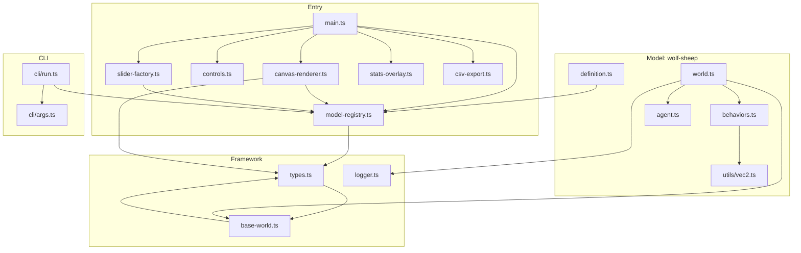

## Architecture Diagram

This diagram MUST be kept up-to-date. Any PR that adds/removes files or changes import relationships MUST update it.



## File Tree

```
sim/
├── index.html                          # HTML shell, CSS variables, layout grid
├── src/
│   ├── main.ts                         # Entry point: wires DOM, animation loop, model loading
│   ├── integration.test.ts             # Cross-module wiring tests
│   ├── stress.test.ts                  # 1000-tick stability, NaN checks, oscillation validation
│   ├── cli/
│   │   ├── run.ts                      # Headless CLI runner (zero DOM deps)
│   │   └── args.ts                     # CLI argument parsing
│   ├── utils/
│   │   ├── vec2.ts                     # Pure math: distance, normalize, sub, add, scale
│   │   └── vec2.test.ts               # Vec2 unit tests
│   ├── framework/
│   │   ├── types.ts                    # Core interfaces: Agent, WorldState, World
│   │   ├── base-world.ts              # Abstract BaseWorld class implementing World
│   │   ├── model-registry.ts          # ModelDefinition, registerModel, getModel, listModels
│   │   ├── canvas-renderer.ts         # Renders agents + grass to canvas (scaled coordinates)
│   │   ├── canvas-renderer.test.ts    # Renderer tests with mock canvas context
│   │   ├── controls.ts               # Go/Stop/Step/Reset button wiring
│   │   ├── controls.test.ts           # Controls tests with mock DOM
│   │   ├── slider-factory.ts          # Generates sliders from configSchema
│   │   ├── slider-factory.test.ts     # Slider creation + value binding tests
│   │   ├── stats-overlay.ts           # Population counts overlay + chart rendering
│   │   ├── stats-overlay.test.ts      # Stats display tests
│   │   ├── csv-export.ts             # CSV export of populationHistory
│   │   └── logger.ts                  # Structured event logger (level, category, message)
│   └── models/
│       ├── index.ts                    # Barrel import — triggers all model registrations
│       ├── _template/                  # Copy this directory to create a new model
│       │   ├── definition.ts
│       │   ├── world.ts
│       │   ├── agent.ts
│       │   ├── behaviors.ts
│       │   ├── behaviors.test.ts
│       │   └── world.test.ts
│       └── wolf-sheep/
│           ├── definition.ts           # wolfSheepDef: 17 config params, 2 agent types, 2 toggles
│           ├── world.ts               # WolfSheepWorld: setup, step (7-phase tick), getPopulationCounts
│           ├── agent.ts               # createWolf, createSheep, createGrassGrid, GrassPatch interface
│           ├── agent.test.ts          # Agent factory tests
│           ├── behaviors.ts           # Pure functions: flee, chase, bounce, catch, reproduce, findGrass
│           ├── behaviors.test.ts      # Behavior unit tests
│           └── world.test.ts          # World lifecycle + multi-tick tests
```

## Data Flow

```
main.ts
  │
  ├── import './models/index.js'     ← triggers registerModel() for each model
  ├── listModels()                   ← populates <select> dropdown
  ├── loadModel(id)
  │     ├── getModel(id)             ← retrieves ModelDefinition from registry
  │     ├── def.createWorld(config)  ← instantiates World subclass
  │     ├── world.setup()            ← spawns initial agents + extraState
  │     ├── createSliders(def, world, container)
  │     └── setupControls(world, def, container)
  │
  └── requestAnimationFrame(loop)
        ├── world.step()             ← advances simulation by one tick
        ├── render(ctx, world, model) ← draws grass + agents to canvas
        ├── renderStats(ctx, world, model)
        ├── renderChart(chartCtx, world, model)
        └── update DOM counters      ← #tick-display, [data-pop-key] spans
```

## Key Interfaces

### Agent (`framework/types.ts`)

| Field    | Type                      | Description                                  |
|----------|---------------------------|----------------------------------------------|
| id       | `number`                  | Unique identifier, assigned by world         |
| type     | `string`                  | Agent kind: `'wolf'`, `'sheep'`, etc.        |
| x, y     | `number`                  | Position in world coordinates                |
| vx, vy   | `number`                  | Velocity components                          |
| radius   | `number`                  | Visual and collision radius (pixels)         |
| speed    | `number`                  | Movement speed per tick                      |
| energy   | `number`                  | Current energy; dies at 0                    |
| color    | `string`                  | Hex color for rendering                      |
| alive    | `boolean`                 | Whether the agent is active                  |
| meta     | `Record<string, unknown>` | Extensible metadata bag                      |

### WorldState / World (`framework/types.ts`)

| Field             | Type                          | Description                          |
|-------------------|-------------------------------|--------------------------------------|
| agents            | `Agent[]`                     | All agents (alive and dead)          |
| config            | `Record<string, number>`      | Current configuration values         |
| running           | `boolean`                     | Whether the simulation is active     |
| tick              | `number`                      | Current tick count                   |
| populationHistory | `Record<string, number>[]`    | Population counts per tick           |
| extraState        | `unknown`                     | Model-specific state (e.g., grass)   |
| setup()           | `void`                        | Initialize agents and state          |
| step()            | `void`                        | Advance one tick                     |
| reset()           | `void`                        | Reset tick/history, call setup()     |
| updateConfig()    | `void`                        | Merge partial config via Object.assign |
| getPopulationCounts() | `Record<string, number>`  | Current population snapshot          |

### ModelDefinition (`framework/model-registry.ts`)

| Field         | Type                              | Description                              |
|---------------|-----------------------------------|------------------------------------------|
| id            | `string`                          | Unique model identifier                  |
| name          | `string`                          | Human-readable name                      |
| description   | `string`                          | Short description                        |
| context       | `string`                          | Multi-line explanation of model dynamics  |
| credit?       | `string`                          | Attribution text                         |
| defaultConfig | `Record<string, number>`          | Default values for all config keys       |
| configSchema  | `ConfigField[]`                   | Slider definitions (key, label, min, max, step, default, info?) |
| agentTypes    | `AgentTypeDefinition[]`           | Visual definitions (type, color, radius, shape) |
| toggles?      | `ToggleField[]`                   | Boolean toggle definitions (key, label, default) |
| createWorld() | `(config) => World`               | Factory function                         |

### BaseWorld (`framework/base-world.ts`)

Abstract class implementing `World`. Subclasses must implement:
- `setup()` — spawn agents, initialize extraState
- `step()` — advance simulation one tick (call `recordPopulation()` at end)
- `getPopulationCounts()` — return current counts by type

Concrete methods provided:
- `reset()` — resets tick to 0, clears populationHistory, sets running to false, calls `setup()`
- `updateConfig(partial)` — merges via `Object.assign(this.config, partial)`
- `recordPopulation()` — pushes `getPopulationCounts()` to history and increments tick

## Slider Pipeline

```
configSchema (definition.ts)
  → slider-factory.ts creates <input type="range"> per ConfigField
  → User drags slider → 'input' event
  → world.updateConfig({ [key]: newValue })
  → Next step() uses updated config values
```

Each slider reads `ConfigField.key`, `label`, `min`, `max`, `step`, `default`, and optional `info` tooltip.

## Render Pipeline

```
world.agents + world.extraState
  → canvas-renderer.ts: render(ctx, world, model)
     ├── Clear canvas with --bg-primary
     ├── Draw grass grid if extraState has grass patches
     ├── Scale world coords → canvas coords (scaleX = canvasW / worldW)
     └── Draw each alive agent as a filled circle
  → stats-overlay.ts: renderStats(ctx, world, model)
  → stats-overlay.ts: renderChart(chartCtx, world, model)
     └── Draws populationHistory as line chart on separate canvas
```

Canvas sizing: `ResizeObserver` on `.canvas-area` updates `simCanvas.width/height`. The drag handle adjusts the CSS grid column, triggering re-observation.

## Layer Enforcement

The framework-model boundary is enforced at two levels:

1. **ESLint `no-restricted-imports`**: prevents `framework/` from importing `models/`
2. **Headless CLI**: `npx tsx sim/src/cli/run.ts` runs the engine with zero DOM — if a model accidentally imports DOM code, this fails

Any new file must respect this boundary. If you need shared logic, it goes in `framework/` or `utils/`.
